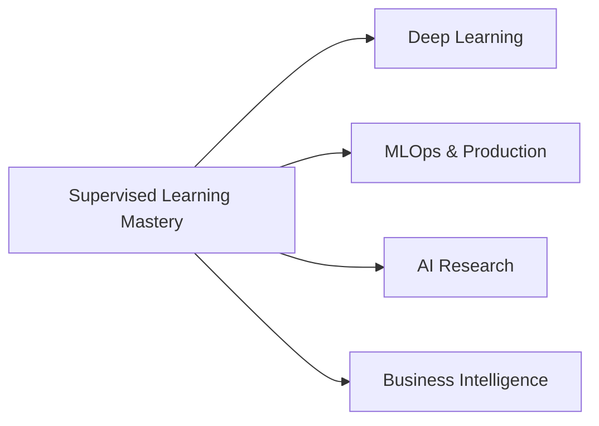

# 🚀 Amazon ML Summer School 2025 - Supervised Learning Journey

<div align="center">


*🎯 Mastering the fundamentals of supervised learning from Amazon's experts*

</div>

---

## 📚 What I Learned Today

### 🧠 Module 1: Foundations of Supervised Learning

#### 🎯 **Key Concepts Mastered:**
- **🔄 ML Pipeline Architecture**
  - Training vs Prediction phases
  - Feature engineering and data preparation
  - Model evaluation strategies

- **⚖️ Bias-Variance Trade-off**
  - Understanding overfitting vs underfitting
  - Regularization techniques (L1 & L2)
  - Cross-validation best practices

- **📊 Linear Models Deep Dive**
  - Linear Regression with closed-form solutions
  - Logistic Regression with sigmoid functions
  - Gradient descent optimization algorithms

#### 🛠️ **Technical Skills Gained:**
```python
# Loss Functions
- Squared Loss: (y - f(x))²
- Logistic Loss: -log(sigmoid(y * f(x)))
- Regularization: λ * ||w||₁ or λ * ||w||₂

# Optimization
- Batch Gradient Descent
- Mini-batch updates
- Learning rate scheduling
```

---

### 🌳 Module 2: Tree-Based Models & Ensembles

#### 🎯 **Advanced Techniques Learned:**

- **🌲 Decision Trees**
  - Recursive partitioning algorithms
  - Gini impurity and entropy splitting criteria
  - Pruning strategies to prevent overfitting

- **🎪 Ensemble Methods**
  - **Random Forests:** Bootstrap aggregation + feature randomness
  - **AdaBoost:** Sequential weak learners with adaptive weights
  - **Gradient Boosting:** Functional gradient descent approach

#### 🔥 **Power Algorithms Mastered:**
```yaml
Bagging:
  - Multiple bootstrap samples
  - Parallel tree training
  - Variance reduction through averaging

Boosting:
  - Sequential error correction
  - Exponential training error reduction
  - High-bias to low-bias transformation
```

---

### 📈 Module 3: Evaluation & Classical Algorithms

#### 🎯 **Evaluation Expertise:**

- **📊 Performance Metrics**
  - Precision, Recall, F1-Score for imbalanced data
  - ROC-AUC and PR-AUC for ranking quality
  - MSE, RMSE, MAE for regression tasks

- **🔍 Classical ML Algorithms**
  - **Naive Bayes:** Probabilistic classification
  - **k-NN:** Instance-based learning
  - **SVM:** Maximum margin classification with kernels

#### ⚠️ **Critical Challenges Addressed:**
- **Curse of Dimensionality** in high-dimensional spaces
- **Model Selection** using cross-validation
- **Hyperparameter Tuning** strategies

---

## 🚀 Why This Knowledge Will Transform My Future

### 💼 **Career Impact**

#### 🎯 **Immediate Professional Benefits:**
- **📊 Data Science Roles:** Ready to tackle real-world ML problems
- **🏭 Industry Applications:** Understanding Amazon-scale ML challenges
- **🔬 Research Capabilities:** Strong theoretical foundation for advanced topics

#### 🌟 **Long-term Strategic Advantages:**


### 🛠️ **Technical Skill Stack Enhancement**

#### 🔧 **Core Competencies Developed:**
- **Algorithm Selection:** Know when to use which ML approach
- **Performance Optimization:** Bias-variance trade-off mastery
- **Production Readiness:** Understanding real-world constraints

#### 🎓 **Advanced Learning Pathway:**
1. **Next Steps:** Deep Learning, Reinforcement Learning
2. **Specializations:** Computer Vision, NLP, Time Series
3. **Leadership:** ML Strategy, Team Management

---

### 🌍 **Real-World Applications**

#### 🏢 **Industry Use Cases I Can Now Handle:**
| Domain | Application | My Skill |
|--------|------------|----------|
| 🛒 E-commerce | Product Recommendation | Ensemble Methods |
| 🏦 Finance | Fraud Detection | Imbalanced Classification |
| 🏥 Healthcare | Diagnostic Prediction | Feature Engineering |
| 📱 Tech | User Behavior Prediction | Multi-class Classification |

#### 💡 **Problem-Solving Toolkit:**
- **🎯 Classification Problems:** Customer segmentation, spam detection
- **📈 Regression Tasks:** Price prediction, demand forecasting
- **🔄 Ensemble Solutions:** Complex pattern recognition
- **⚡ Performance Optimization:** Large-scale data handling

---

## 🎯 **Learning Outcomes & Metrics**

### ✅ **Mastery Checklist:**
- [x] 🧠 Theoretical foundations of supervised learning
- [x] 🔧 Practical implementation knowledge
- [x] 📊 Evaluation and validation techniques
- [x] 🌳 Advanced ensemble methods
- [x] ⚖️ Bias-variance optimization strategies

 

---

## 🎉 **Final Thoughts**

> *"Today's learning session has equipped me with the fundamental building blocks of machine learning. From understanding the mathematical foundations to implementing advanced ensemble techniques, I now have the confidence to tackle real-world ML challenges."*

### 🔮 **Future Vision:**
This supervised learning foundation will serve as the **cornerstone** for my journey into:
- 🤖 **Artificial Intelligence Research**
- 📊 **Advanced Data Science Roles** 
- 🚀 **ML Engineering Positions**
- 💼 **Technical Leadership Opportunities**

---

<div align="center">

### 🙏 **Acknowledgments**

**Special Thanks to Amazon ML Summer School 2024 Instructors:**
- 👨‍🏫 **Anil** - Foundations & Linear Models
- 👨‍🏫 **Abhishek** - Tree-Based Models & Ensembles  
- 👩‍🏫 **Mayang** - Evaluation & Classical Algorithms

---

*🌟 Keep Learning • Keep Growing • Keep Building Amazing Things! 🌟*

[](https://www.linkedin.com/in/nikhilkr16/)
[]([your-github](https://github.com/nikhilkr16/))
[](mailto:nikhilkr3000@gmail.com)

</div>
